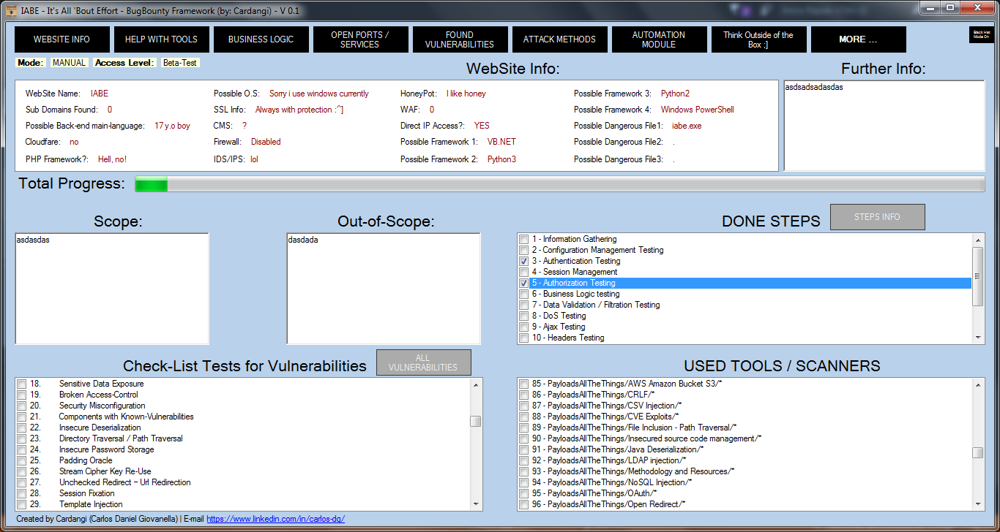

# IABE WEB BugBounty Framework

### Tool Description
What this tool really is? Basically, it's the junction of all knowledge that I gathered from more than 40 DefCon talks and 5 books of web pentesting. There's guides for every tool that you could imagine, and I assure that you don't know 100% of them. There are more than 150 web vulnerabilities detailed, PoC's, how-to, where to find, etc.

### Tool Purpose
It was mainly created to help you organize the data, to-do tests, think outside of the box, and ensure that you tested every single layer with every single exploit/scanner/thinking outside of the box. Modules for data organization, check-marks for tested vulnerabilities, check-marks for used tools, different approachs (attack methods) to website PenTesting with different tools, etc.

Basically, it will help you go deeper than a common pentest. Trying to help you with tips of how you could exploit, how to think outside of the box, what vulnerability you could find in the system, what are in scope of bounty program, what are out of scope, organize the data that you found, helps you to put all what you found in one place. And them, give you tips of possible exploiting, for example: You scanned with NMAP and it shows that port 445 is OPEN. So you mark in the framework that this port is open. But, you don't know (really?) about MS017-010. The framework will tell you that is POSSIBLE to work (guess) the "exploit/windows/smb/ms17_010_eternalblue". 

It automates a lot of proccess too. There are guides of usage of more than 200 tools. Complete but simple guides. Just CTRL-C + CTRL-V in terminal/cmd line. Guides of simple attacks to advanced attacks. JUST CTRL C CTRL V BOY. Or button-click "automate" some functions too.

Finishing, I tried to put all web pentesting / BugBounty stuff in one place, tools guides, books, tips, thinking outside of the box, scanning, vulnerabilities, attack methods, automation, data organization, etc. Unfortunately i'm just a 17 y.o kid who knows nothing about web pentesting, so you can feel free to give me ideas to improve the program, and i'll be grateful.
### Only Framework Installation
```
mkdir IABE
cd IABE
git clone https://github.com/cardangi/IABE-BugBounty-Framework.git
```
### Installation Guide (basic dependencies included)
```
mkdir IABE
cd IABE
git clone https://github.com/cardangi/IABE-BugBounty-Framework.git
git clone https://github.com/danielmiessler/SecLists.git
git clone https://github.com/1N3/IntruderPayloads.git
git clone https://github.com/swisskyrepo/PayloadsAllTheThings.git
git clone https://github.com/guelfoweb/knock.git
git clone https://github.com/nahamsec/HostileSubBruteforcer.git
git clone https://github.com/FortyNorthSecurity/EyeWitness.git
git clone https://github.com/gwen001/s3-buckets-finder.git
git clone https://github.com/1N3/Sn1per.git
git clone https://github.com/laramies/theHarvester.git
git clone https://github.com/michenriksen/aquatone.git
git clone https://github.com/v0re/dirb.git
git clone https://github.com/aboul3la/Sublist3r.git
git clone https://github.com/infosec-au/altdns.git
git clone https://github.com/blechschmidt/massdns.git
git clone https://github.com/lorenzog/dns-parallel-prober.git
git clone https://github.com/rbsec/dnscan.git
git clone https://github.com/anshumanbh/brutesubs.git
git clone https://github.com/mandatoryprogrammer/cloudflare_enum.git
git clone https://github.com/OJ/gobuster.git
git clone https://github.com/danielmiessler/RobotsDisallowed.git
git clone https://github.com/maK-/parameth.git
git clone https://github.com/JordyZomer/autoSubTakeover.git
git clone https://github.com/anshumanbh/tko-subs.git
git clone https://github.com/0xSearches/sandcastle.git
git clone https://github.com/michenriksen/gitrob.git
git clone https://github.com/dxa4481/truffleHog.git
git clone https://github.com/nmap/nmap.git
git clone https://github.com/sullo/nikto.git
git clone https://github.com/allfro/BurpKit.git
git clone https://github.com/wireshark/wireshark.git
git clone https://github.com/jhaddix/domain.git
git clone https://github.com/zaproxy/zaproxy.git
git clone https://github.com/OWASP/OWASP-WebScarab.git
git clone https://github.com/xmendez/wfuzz.git
git clone https://github.com/subgraph/Vega.git
git clone https://github.com/poerschke/Uniscan.git
git clone https://github.com/commixproject/commix.git
git clone https://github.com/ewilded/psychoPATH.git
git clone https://github.com/michenriksen/aquatone.git
git clone https://github.com/andresriancho/w3af.git
git clone https://github.com/Arachni/arachni.git
git clone https://github.com/neuroo/grabber.git
git clone https://github.com/IFGHou/wapiti.git
git clone https://github.com/spinkham/skipfish.git
git clone https://github.com/wpscanteam/wpscan.git
git clone https://github.com/sqlmapproject/sqlmap.git
git clone https://github.com/allfro/sploitego.git
git clone https://github.com/insp3ctre/race-the-web.git
git clone https://github.com/ElevenPaths/Eternalblue-Doublepulsar-Metasploit.git
git clone https://github.com/rapid7/metasploit-framework.git
git clone https://github.com/RetireJS/retire.js.git
git clone https://github.com/vulnersCom/burp-vulners-scanner.git
git clone https://github.com/robertdavidgraham/masscan.git
```
### Firefox Plugins
https://addons.mozilla.org/pt-BR/firefox/addon/foxyproxy-standard/

https://addons.mozilla.org/pt-BR/firefox/addon/offsec-exploit-db-search/

https://addons.mozilla.org/pt-BR/firefox/addon/firebug/

https://addons.mozilla.org/pt-BR/firefox/addon/hackbar/

https://addons.mozilla.org/en-US/firefox/user/websecurify/

https://addons.mozilla.org/en-US/firefox/addon/a-cookie-manager/

https://addons.mozilla.org/pt-BR/firefox/addon/xss-me/

https://addons.mozilla.org/pt-BR/firefox/addon/wappalyzer/

https://addons.mozilla.org/pt-BR/firefox/addon/builtwith/
#### Requirements
- NET Framework 4.5.2
- Python 3.4
- Python 2.7
### IMPORTANT
This is on beta test and should not be used for real penetration testing. Not all dependencies included, because it would be kinda-impossible. Needs a pentest OS installed to use some attacks, or manual installing of nmap / sqlmap / metasploit / recon-ng / etc...
#### I didn't created a installer with with "all dependencies" because I don't own the scripts/programs/etc used, and I could get in problems with differents licenses. Please, be kind.
